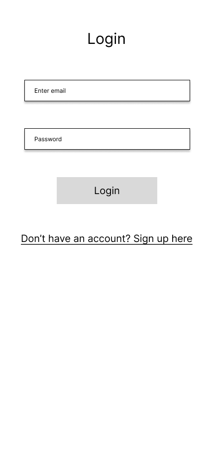

# User Experience Design

This repository contains instructions and files for two assignments that together comprise the user experience design phase of a web app.

Replace the contents of this file with the completed assignments, as described in:

- [app map & wireframe instructions](instructions-0a-app-map-wireframes.md).
- [prototype instructions](instructions-0b-prototyping.md)

<br>

### General Note

(James) I just want to call out that we still need to define the scope of geolocation feature and integrate said feature into this design document.

## Prototype

Our Figma prototype can be found [here](https://www.figma.com/file/GhOlgSznfhKvBRaolR6QmS/Design?node-id=0%3A1&t=5c9wqDCxQt9QgBkg-1).

I also added the ```.fig``` file to the ```/ux-design/prototype``` folder. 

## App Map

This is the app map. Basically, users just search, by restaurant or dish, to either view dishes or review a dish, or to add not-yet-added dishes/restaurants. 


<br />

## Wireframes

Here's the wireframes!

### Home (unauthenticated)

This is the "landing page" of the app. It shows generic options.


<br />

### Login

Simple Login flow. 



<br />

### Sign Up

Simple Sign-up flow. 


<br />

### Home (authenticated)

Authenticated users redirect here. Users can either click recommendations or search.


<br />

### Search (wo input)

This is the search screen before users have entered input. Users must select either restaurants or dishes to search by.


<br />

### Search by Dish 

This screen displays the search results for searching by dish. Images are taken from reviews of dishes.  


<br />


### Search by Restaurant

This screen displays the search results for searching by restaurant. Images are taken from reviews of high-rated dishes at those restaurants. 


<br />

### Add a Restaurant

If you can't find a restaurant, add it!


<br />

### Restaurant Detail View

Click on a restaurant and you get sent here. You see top dishes. If you can't find a dish you want to review or browse, you can add it!


<br />

### Add a Dish

To add a dish.


<br />

### Dish Detail View

This shows detail about the dish. And you can leave a review!


<br />

### Leave a Review

How was the dish? Be honest.


